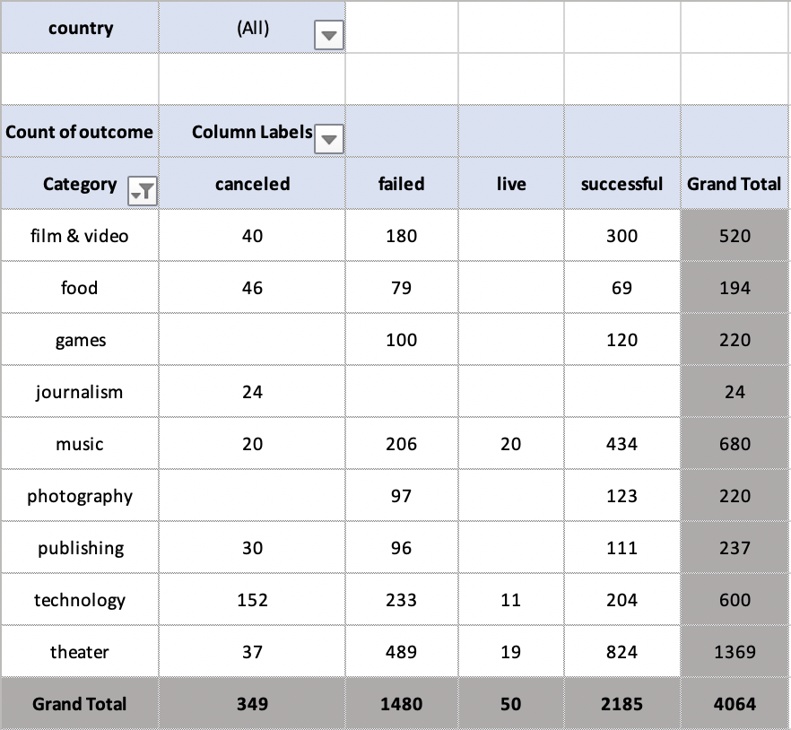
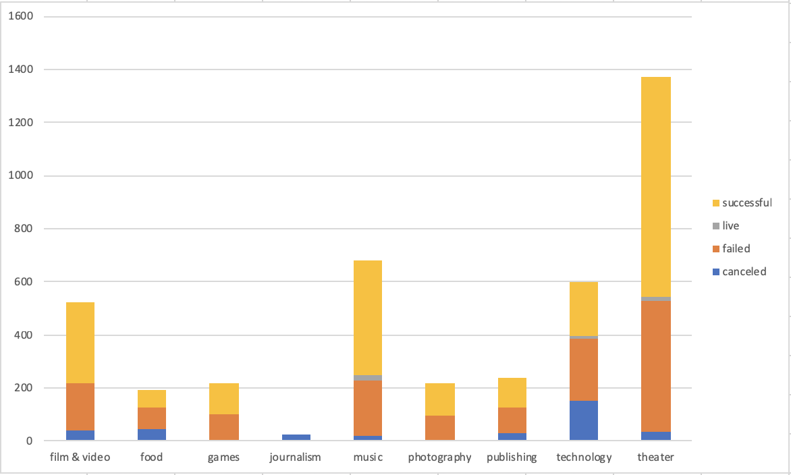
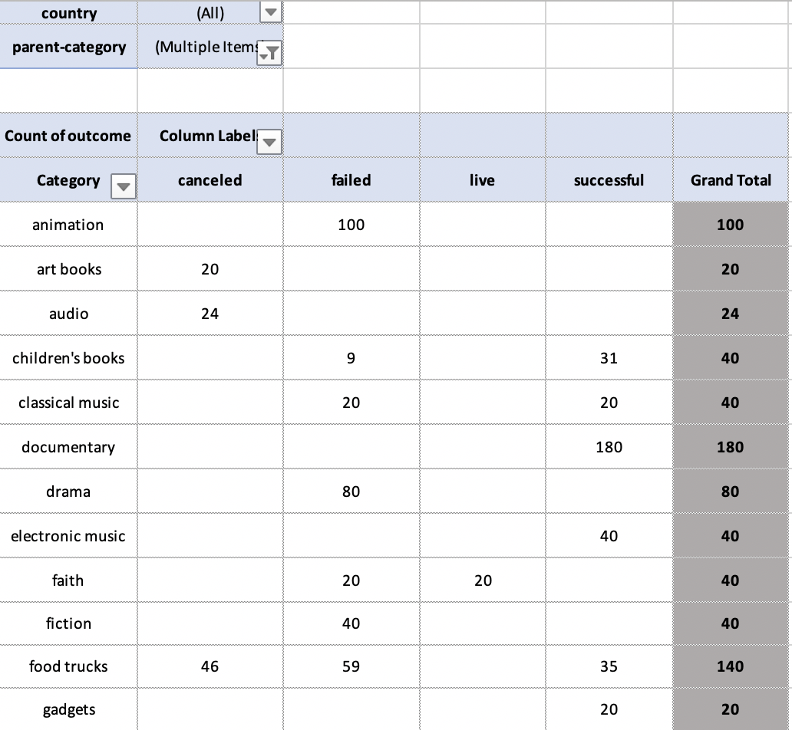
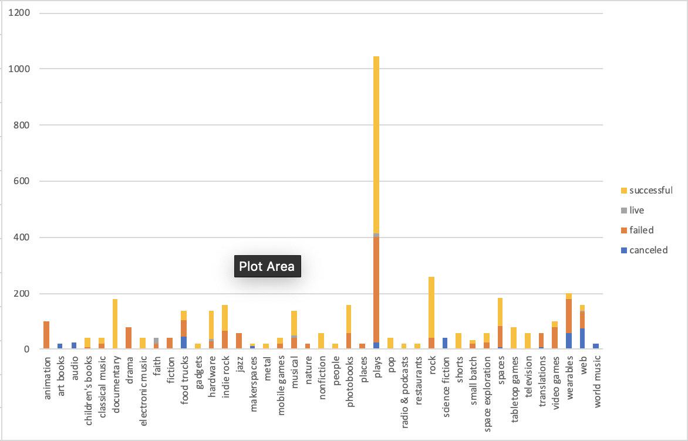
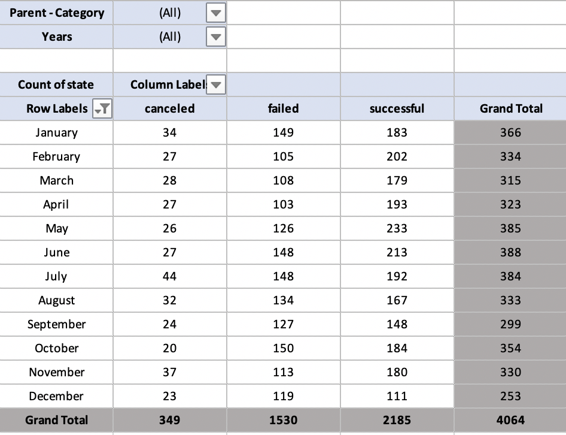
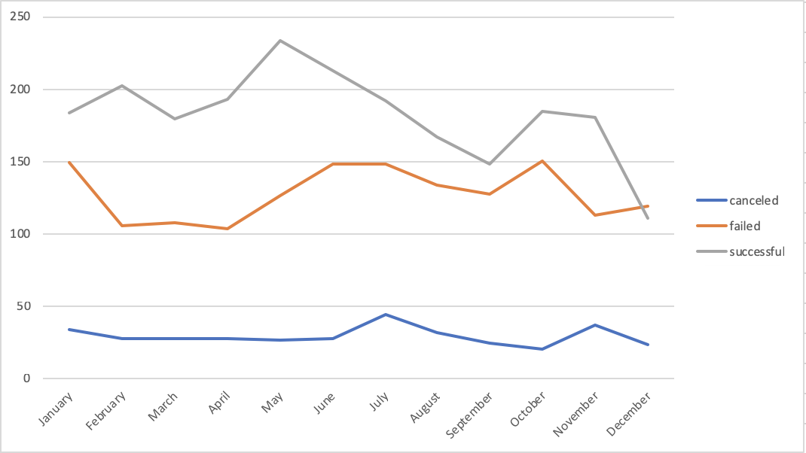
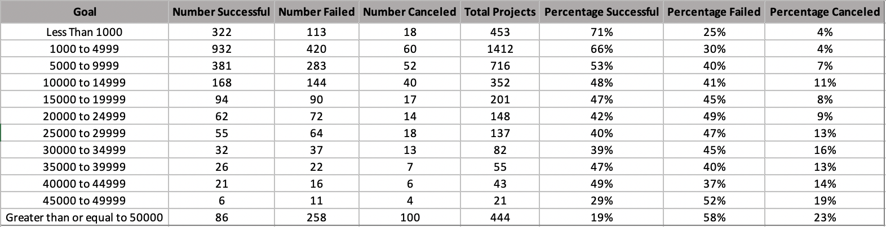
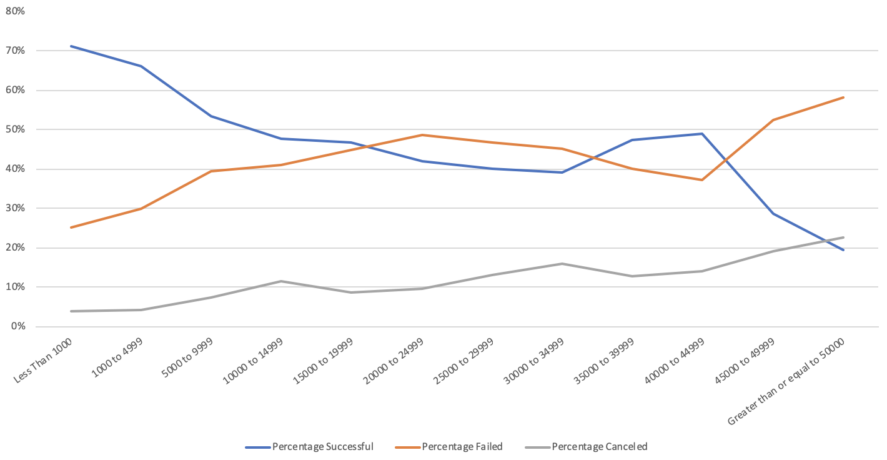

# KickStarter Campaign Analysis

## Objective

Objective of this Project was to analyze KickStarter Campaign data. Over two billion dollars have been raised using the massively successful crowdfunding service, Kickstarter, but not every project has found success. Of the over 300,000 projects launched on Kickstarter, only a third have made it through the funding process with a positive outcome.

Since getting funded on Kickstarter requires meeting or exceeding the project's initial goal, many organizations spend months looking through past projects in an attempt to discover some trick to finding success. Thus in this project data of four thousand projects was analyzed to uncover hidden trends.

## Approach

### Basic Indicators
---
Using conditional formatting, a basic indicator on the "state "column was set. Based on the state of a project color was set to give a quick glance at the project's performance. 

| State | Conditional Formatting |
| ------------- | ------------- |
| Successful | |
| Live | |
| Failed | |
| Cancelled ||

### Basic Calculations
---
| Column | Purpose | Formula |
| ------------- | ------------- | ------------- |
| Percent Funded | To compare how much a project was funded based on pledged and goal amount | pledged / goal * 100
| Average Donation | To see how much how much each backer for the project paid on average.  | pledged / backers_count 

### By Category 
---
Using the pivot table feature of excel, the 
projects were grouped by Category of Projects and a 
metric was created to compare how many projects were successful or not in each category.

Data was visualized for better interpretation of the trends

### By Sub-Category
Using the pivot table feature of excel, the 
projects were grouped by Sub-Category of Projects and a 
metric was created to compare how many projects were successful or not in each sub-category.

Data was visualized for better interpretation of the trends

### By Months 
Using the pivot table feature of excel, the 
projects were grouped by Months the Projects were realesed and a metric was created to compare how many projects were successful or not in each month.

Data was visualized for better interpretation of the trends

### By Goal
Using the pivot table feature of excel, the 
projects were grouped by Goal amount range of the Projects  and a metric was created to compare how many projects were successful or not in each month.

Data was visualized for better interpretation of the trends

### Trends 

- Trend 1: Projects with Category Theater had the highest success rate.
- Trend 2: Projects with Sub-Category Plays had the highest success rate which ties closely to our first trend.
- Trend 3: Month of May was were most projects were successful.

## Skills Learned 
- Excel 
- Data Visualization 
- Data Analysis 
- KickStarter methodologies 

## Fututre improvements 
- More KPI's and trends will be found 
- Better visualization will be done with excel 
- More detailed analysis
